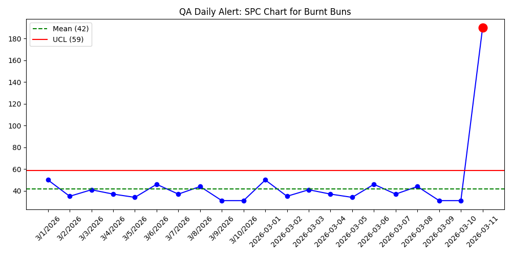

# Automated-SPC-QA-Watchdog
An event-driven Python architecture for Automated Statistical Process Control (SPC) in Food Manufacturing.
# Automated Statistical Process Control (SPC) Watchdog for a Food Manufacturing

**Author:** Jovit Paul Magadan | Plant Manager, Agricultural Engineer & MBA 
**Industry:** Food & Beverage Manufacturing / QA Automation  
**Tech Stack:** Python, Pandas, Matplotlib, Watchdog, smtplib

## The Business Problem
In fast-paced food manufacturing, Quality Assurance (QA) data is often logged into Excel or ERP systems by encoders at the end of a shift. Traditionally, QA Managers manually download this data, calculate Upper/Lower Control Limits (UCL/LCL), and draw Statistical Process Control (SPC) charts. 
* **The issue:** This creates a 12-to-24-hour delay. By the time a supervisor sees that a machine's defect rate spiked, the defective products have already been packaged and shipped, resulting in massive waste and rework costs.

## The Solution: Event-Driven Architecture
I built an automated, event-driven Python architecture that completely eliminates manual QA data processing. 

Acting as a digital "Watchdog," this script silently monitors the plant's local server folders. The exact second a QA Encoder saves the end-of-shift CSV file, the Watchdog instantly wakes up, processes the data, calculates the 3-Sigma limits, flags anomalies, and emails a graphical report to the Plant Manager's phone.

## How It Works
1. **Folder Monitoring:** Uses the Python `watchdog` library to continuously monitor the local `2025_Production_Data` folder with zero CPU strain.
2. **Data Validation:** Reads the newly saved CSV file via `pandas` and strictly verifies timestamps to prevent duplicate alerts from accidental saves.
3. **Automated SPC Math:** Dynamically calculates historical Means and 3-Sigma Control Limits (UCL) based on 90-day trailing data.
4. **Data Visualization:** Uses `matplotlib` to invisibly render a professional SPC chart. If today's defect count (e.g., "Burnt" buns) breaches the UCL, the data point is flagged in **RED**.
5. **Real-Time Alerts:** Uses `smtplib` to securely log into the plant's automated email server and push the chart directly to stakeholders.

## Example Output
*(The system automatically generates and emails charts like this within 1 second of the encoder hitting 'Save')*

 *(Note: Make sure the file name matches the image you uploaded!)*

## Impact
* **Labor Reduction:** Saves QA teams ~10 hours per week in manual Excel charting.
* **Waste Reduction:** Shifts plant maintenance from *reactive* (finding out tomorrow) to *proactive* (knowing the second the shift ends).
* **Data Integrity:** Removes human error from complex statistical calculations.
